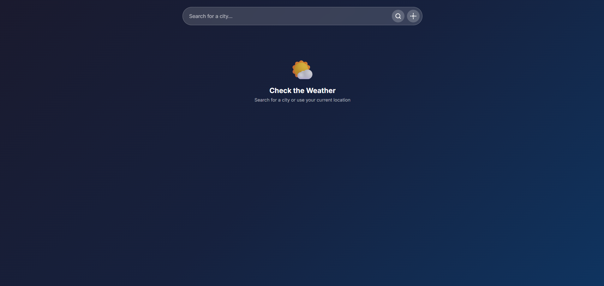

🌤️ Weather Dashboard App

A simple and interactive weather application built with JavaScript using the OpenWeather API.

🚀 Features
🔍 Search weather by city name
🌡️ Displays temperature and weather condition
🌤️ Weather icons
⏳ Loading state while fetching data
❌ Error handling (invalid city, API issues)
🧠 Search history (saved using localStorage)
🎨 Dynamic background based on weather
🛠️ Tech Stack
HTML
CSS
JavaScript (Vanilla)
OpenWeather API
📸 Screenshot

📚 What I Learned
How to fetch data from an API using fetch
Using async/await for cleaner asynchronous code
Handling errors in real-world applications
Managing state with localStorage
Improving user experience with loading states and UI feedback
⚠️ Note

This project uses a public API key for learning purposes. In production, API keys should be secured using a backend or environment variables.

📌 Future Improvements
5-day weather forecast
Auto-detect user location
UI enhancements and animations
Convert to React
🙌 Author

